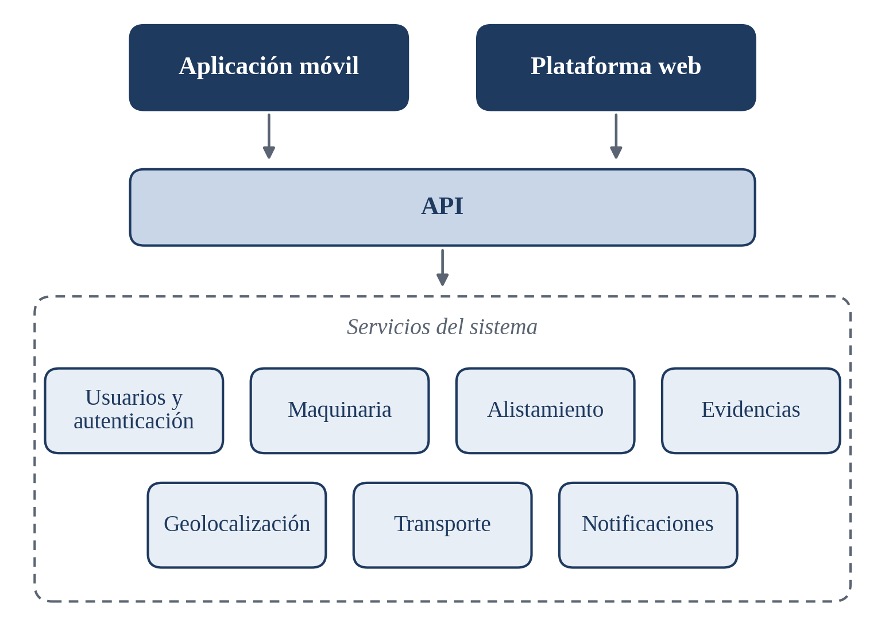

<p align="center">
  
</p>

<p align="center">
  <strong>Sistema de trazabilidad y seguimiento de maquinaria</strong><br>
  App móvil y plataforma web para gestionar alistamiento, evidencias, ubicación y entrega.
</p>

---

## Sobre el proyecto

MaquiTrace digitaliza y centraliza el proceso de alistamiento, despacho y entrega de maquinaria pesada. Cada máquina se identifica por su categoría y número serial, y todas sus evidencias, fases y eventos quedan vinculados a ese registro.

**El problema:** las fotografías y evidencias del alistamiento, el cargue, el transporte y la entrega suelen quedar dispersas en grupos de mensajería como WhatsApp. Eso dificulta encontrar las de una máquina específica, saber dónde está una vez sale del establecimiento y confirmar a tiempo su llegada al cliente.

**Objetivo:** gestionar la trazabilidad de la maquinaria desde su alistamiento hasta su entrega, centralizando las evidencias y facilitando la consulta de su estado y ubicación.

Propuesta completa: [`docs/propuesta.pdf`](docs/propuesta.pdf)

## Tecnologías

<p align="center">
  
  &nbsp;&nbsp;
  
  &nbsp;&nbsp;
  
  &nbsp;&nbsp;
  
  &nbsp;&nbsp;
  
</p>


## Roles

| Rol | Responsabilidad | Plataforma |
|---|---|---|
| **Operario de alistamiento** | Registrar y actualizar la preparación de la maquinaria: fases, observaciones y evidencias | App móvil |
| **Transportador** | Recibir la máquina, registrar su salida, compartir su ubicación durante el traslado y confirmar la entrega | App móvil |
| **Supervisor / administrador** | Supervisar el proceso, consultar evidencias, ubicación e historial, y gestionar incidencias | Plataforma web |

## Funcionalidades

| Funcionalidad | Descripción |
|---|---|
| **Registro por serial** | Consulta y registro de maquinaria por categoría y número serial |
| **Fases de alistamiento** | Ensamblaje, pintura y lavado, con estado y observaciones por fase |
| **Evidencias** | Fotos y videos capturados desde la app, asociados a la máquina y a la fase o evento |
| **Código QR** | Identificación rápida de la máquina para reducir errores al registrar |
| **Geolocalización** | Posiciones periódicas durante el transporte y ubicación de la entrega |
| **Transporte y entrega** | Recepción, salida, novedades, llegada y confirmación con evidencia |
| **Notificaciones** | Asignaciones, fin de alistamiento, salidas, incidencias y entregas |
| **Panel de supervisión** | Indicadores, historial, incidencias y mapa de máquinas en tránsito |

## Flujo del proceso

1. Registro o identificación de la maquinaria
2. Inicio del alistamiento
3. Registro de fases: ensamblaje, pintura y lavado
4. Captura de evidencias durante las fases
5. Inspección y registro fotográfico final
6. Registro del cargue y preparación para despacho
7. Recepción por parte del transportador
8. Registro de salida y activación del seguimiento por GPS
9. Seguimiento del transporte y registro de novedades
10. Registro de llegada y evidencia de entrega
11. Cierre del proceso y almacenamiento del historial

## Arquitectura propuesta

La aplicación móvil y la plataforma web consumen una API que se apoya en servicios que separan las responsabilidades del sistema: usuarios y autenticación, maquinaria, alistamiento, evidencias, geolocalización, transporte y notificaciones. Según el alcance, algunos pueden implementarse como servicios independientes.

<p align="center">
  
</p>

## Alcance inicial (v1)

- [ ] Registro de maquinaria
- [ ] Gestión de las tres fases de alistamiento
- [ ] Captura y consulta de evidencias
- [ ] Identificación mediante QR
- [ ] Geolocalización
- [ ] Gestión del transporte
- [ ] Confirmación de entrega
- [ ] Plataforma web de supervisión

## Metodología y Planificación

El proyecto sigue una metodología ágil iterativa basada en **Scrum**, distribuida en **6 Sprints** de desarrollo, apoyada en las siguientes herramientas colaborativas:

- **Figma:** Prototipado y diseño UI/UX (móvil y web).
- **Trello:** Tablero Kanban y gestión del Backlog de producto.
- **Slack:** Canal de comunicación del equipo y acuerdos de trabajo.

| Sprint | Enfoque Principal | Entregable Clave |
|:---:|---|---|
| **Sprint 1** | UI/UX en Figma, modelado de datos y autenticación | Prototipo visual completo, esquema de BD y login con roles funcional |
| **Sprint 2** | Registro de maquinaria y QR (Mobile) | Escaneo/registro por serial y las tres fases de alistamiento |
| **Sprint 3** | Evidencias y despacho (Mobile) | Captura de fotos/video por fase y recepción del transportador |
| **Sprint 4** | Transporte y tracking GPS (Mobile) | Seguimiento en ruta, incidencias y confirmación de entrega |
| **Sprint 5** | Plataforma Web de Supervisión (Dashboard) | Panel en React + TS, mapa en vivo y galería de evidencias |
| **Sprint 6** | Integración, despliegue, pruebas y sustentación | Sistema desplegado, APK generado y sustentación ante el docente |

> Para consultar el desglose detallado de tareas, historias de usuario y criterios de aceptación, revisa: [`docs/sprints.md`](docs/sprints.md)

## Estructura del repositorio

```
MaquiTrace/
├── branding/  # logo e identidad visual (fuente única)
├── mobile/    # app móvil (Flutter)
├── web/       # plataforma web
└── docs/      # propuesta, sprints y recursos
```

## Estado

En fase de diseño. La propuesta está entregada y aún no se define la tecnología de la plataforma web ni del backend.

## Equipo

Proyecto académico del **Grupo 4**, Seminario de Actualización, Ingeniería de Sistemas, Universidad del Pacífico. Docente: Ing. G. Lucio.

- Jhon Jader Riascos Angulo
- Charly Jhoan Murillo Hernández