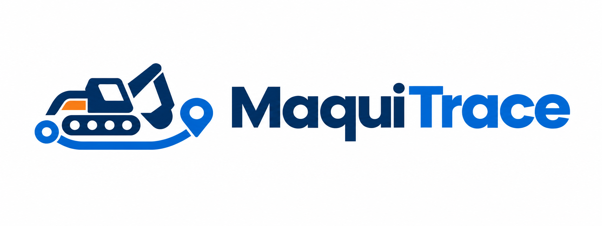

  

<h1 align="center">Planificación de Sprints</h1>

  Metodología de desarrollo ágil (Scrum) &middot; Gestión y seguimiento

  
  &nbsp;&nbsp;&nbsp;&nbsp;
  
  &nbsp;&nbsp;&nbsp;&nbsp;
  

  Este documento establece la metodología de desarrollo ágil (Scrum) adoptada para el proyecto <strong>MaquiTrace</strong>, desglosando los objetivos, tareas e historias de usuario distribuidas a lo largo de <strong>6 Sprints</strong>.

---

## Herramientas de Gestión y Trabajo Colaborativo

| Herramienta | Propósito | Enlace / Espacio |
|---|---|---|
| **Figma** | Diseño UI/UX y prototipo visual de pantallas clave (móvil y web) | *Enlace al archivo de Figma* |
| **Trello** | Tablero Kanban, gestión del Backlog de producto y seguimiento de tareas por Sprint | *Enlace al tablero de Trello* |
| **Slack** | Canal de comunicación del equipo, minutas de reuniones y alertas | `#maquitrace-dev` |

---

## Nota sobre el backend

El Sprint 1 asume una API propia con base de datos PostgreSQL, autenticación por roles y control de acceso construidos desde cero. Si el docente confirma que se puede trabajar con una plataforma como Supabase, ese bloque se reduce a configuración (esquema, políticas de acceso y autenticación ya provista) y el tiempo liberado se reinvierte en el resto del Sprint 1 o se adelanta trabajo del Sprint 2.

---

## Resumen del Cronograma

| Sprint | Enfoque Principal | Entregable Clave |
|:---:|---|---|
| **Sprint 1** | UI/UX en Figma, modelado de datos y autenticación | Prototipo visual completo, esquema de BD y login con roles funcional |
| **Sprint 2** | Registro de maquinaria y QR (Mobile) | Escaneo/registro por serial y las tres fases de alistamiento |
| **Sprint 3** | Evidencias y despacho (Mobile) | Captura de fotos/video por fase y recepción del transportador |
| **Sprint 4** | Transporte y tracking GPS (Mobile) | Seguimiento en ruta, incidencias y confirmación de entrega |
| **Sprint 5** | Plataforma Web de Supervisión (Dashboard) | Panel en React + TS, mapa en vivo y galería de evidencias |
| **Sprint 6** | Integración, despliegue, pruebas y sustentación | Sistema desplegado, APK generado y sustentación ante el docente |

---

## Desglose Detallado por Sprint

### Sprint 1: Diseño UI/UX y Fundaciones del Sistema
> **Objetivo:** Completar el prototipo visual en Figma, modelar la base de datos y dejar funcional el login con roles.

#### 1. Diseño UI/UX (Figma)
- [x] Pantalla de Login.
- [x] Pantalla de Recuperar contraseña.
- [x] Home.
- [ ] Pantallas de alistamiento (escáner QR, fases con checklist).
- [ ] Pantallas del transportador (recepción, ruta, entrega).
- [ ] Vistas esenciales de la Plataforma Web (dashboard principal, mapa de monitoreo, detalle de máquina).

#### 2. Configuración de Entornos y Gestión
- [ ] Configurar espacio de trabajo en **Slack** (canales: `#general`, `#desarrollo`, `#alertas-git`).
- [ ] Configurar tablero en **Trello**: `Product Backlog`, `Sprint Backlog`, `En Proceso`, `Revisión/QA`, `Completado`.

#### 3. Base de Datos y Backend Base
- [ ] Diseñar diagrama Entidad-Relación: `usuarios`, `roles`, `maquinarias`, `fases_alistamiento`, `evidencias`, `viajes_transporte`, `registros_gps`, `incidencias`.
- [ ] Definir tecnología de backend (API propia o Supabase, según respuesta del docente).
- [ ] Implementar autenticación (login, cierre de sesión y control de acceso por rol).
- [ ] Endpoint o función administrativa para crear cuentas de operarios y transportadores con su rol asignado.

#### 4. App Móvil (Flutter Base)
- [ ] Configurar estructura modular por features en Flutter.
- [ ] Implementar pantalla de Login con validaciones de formulario.
- [ ] Gestión del estado de sesión y redirección condicional según el rol autenticado.

> **Entregable Sprint 1:** Prototipo visual de las pantallas clave, base de datos definida y flujo de autenticación funcional en la app móvil.

---

### Sprint 2: Registro de Maquinaria y Fases de Alistamiento (Mobile)
> **Objetivo:** Permitir al operario registrar o identificar una máquina y avanzar por sus tres fases de preparación.

#### 1. Identificación y Códigos QR
- [ ] Generación de códigos QR asociados a categoría y número serial.
- [ ] Lector de QR en la app móvil mediante la cámara (`mobile_scanner`).
- [ ] Búsqueda manual por serial como alternativa si el QR no es legible.

#### 2. Control de Fases de Alistamiento
- [ ] Vista con el avance secuencial de las tres fases: ensamblaje, pintura y lavado.
- [ ] Estado y observaciones por fase.
- [ ] Restricción de avance si la fase anterior no está finalizada.

> **Entregable Sprint 2:** El operario escanea o busca una máquina por serial y registra el avance de sus tres fases de alistamiento.

---

### Sprint 3: Evidencias y Despacho (Mobile)
> **Objetivo:** Capturar evidencias visuales del alistamiento y habilitar la recepción de la máquina por parte del transportador.

#### 1. Captura de Evidencias Multimedia
- [ ] Captura de fotografías y video corto desde la app.
- [ ] Asociación de cada evidencia a la máquina, fase y operario responsable.
- [ ] Fotografías finales desde distintos ángulos y del número serial.

#### 2. Recepción y Despacho
- [ ] Vista para el transportador con maquinaria lista para despacho.
- [ ] Confirmación de recepción física (verificación de serial y estado).
- [ ] Registro de salida: fecha, hora y vehículo asignado.

> **Entregable Sprint 3:** El operario deja evidencia completa de cada fase y el transportador puede recibir y despachar la máquina.

---

### Sprint 4: Transporte y Tracking GPS (Mobile)
> **Objetivo:** Seguir la ubicación de la máquina durante el traslado, registrar novedades y confirmar la entrega.

#### 1. Geolocalización en Ruta
- [ ] Captura de coordenadas periódicas mediante GPS (`geolocator`).
- [ ] Envío de la ubicación al servidor durante el trayecto.

#### 2. Incidencias en Ruta
- [ ] Formulario de novedades (falla mecánica, retén vial, desvío).
- [ ] Adjunto de fotografía y nota explicativa.

#### 3. Confirmación de Entrega
- [ ] Registro de llegada al destino con la ubicación final.
- [ ] Fotografía de la entrega y cierre del despacho.

> **Entregable Sprint 4:** El transportador transmite su ubicación durante el viaje, reporta novedades y confirma la entrega con evidencia.

---

### Sprint 5: Plataforma Web de Supervisión (Dashboard)
> **Objetivo:** Construir el panel web donde el supervisor consulta el estado, la ubicación y el historial de la maquinaria.

#### 1. Base del Proyecto Web
- [ ] Inicialización con **React + Vite + TypeScript**.
- [ ] Layout con navegación y rutas protegidas por rol.
- [ ] Conexión a la API/backend.
- [ ] Registro de operarios y transportadores desde la web (Administrador).

#### 2. Mapa de Supervisión
- [ ] Mapa interactivo (Leaflet) con las máquinas en tránsito.
- [ ] Marcadores según estado: en alistamiento, en tránsito, entregada.

#### 3. Historial y Galería de Evidencias
- [ ] Búsqueda por serial, cliente o estado.
- [ ] Ficha de la máquina con la línea de tiempo del proceso.
- [ ] Visor de fotos y videos por fase.

#### 4. Panel de Indicadores
- [ ] Indicadores generales: máquinas en alistamiento, en tránsito, entregadas, incidencias abiertas.

> **Entregable Sprint 5:** Plataforma web donde el supervisor consulta el historial completo de cualquier máquina y ve en el mapa las que están en tránsito.

---

### Sprint 6: Integración, Despliegue, Pruebas y Sustentación
> **Objetivo:** Integrar todo el sistema, desplegarlo, corregir errores y preparar la sustentación.

#### 1. Notificaciones
- [ ] Notificaciones para eventos clave: máquina lista para transporte, incidencia reportada, entrega confirmada.

#### 2. Despliegue
- [ ] Backend y base de datos en la nube (Render, Railway o Supabase).
- [ ] Aplicación web en Vercel o Netlify.
- [ ] Generación del APK de la app móvil.

#### 3. Pruebas Integrales
- [ ] Prueba de punta a punta: registro → alistamiento → despacho → ruta → entrega → consulta en la web.
- [ ] Corrección de errores encontrados.

#### 4. Cierre y Sustentación
- [ ] Consolidación de tareas y cierre del tablero en Trello.
- [ ] Diapositivas y guion de demostración en vivo ante el docente.

> **Entregable Sprint 6:** Sistema desplegado e integrado, APK listo para prueba y sustentación ante el docente.

---

## Alcance extendido (si el tiempo lo permite)

Estas funcionalidades no están en la propuesta entregada al docente. Se abordan solo si los seis sprints anteriores se cumplen con margen:

- [ ] Firma digital del cliente al confirmar la entrega.
- [ ] Modo offline para el GPS, con sincronización al recuperar señal.
- [ ] Notificaciones push (en vez de notificaciones dentro de la app).
- [ ] Exportación de reportes en PDF desde el panel web.